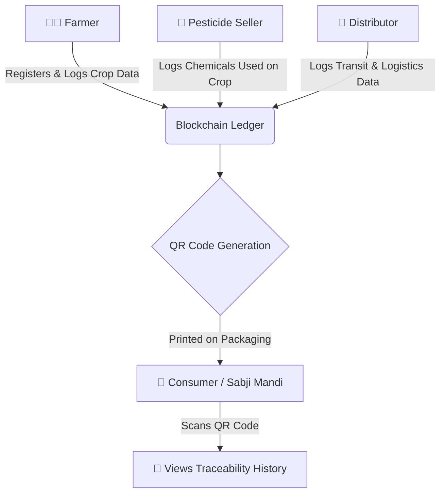

# 🌿 Food Chain: Traceability System


**Redefining Trust in the Food Chain with Blockchain and IoT.**

Consumers often lack clarity about the origin and production of their food, leading to trust issues in the supply chain. Our project leverages blockchain technology to provide complete traceability, ensuring transparent and reliable information from farm to table.

---

## 🚨 Problem Statement
With the modern globalized food supply chain, it is increasingly difficult for consumers to know where their food comes from, how it was grown, and what chemicals or pesticides were used. Fraudulent organic certifications and lack of accountability lead to health concerns and broken trust between the consumer and the agricultural industry.

## 💡 Our Solution
The **Food Chain Traceability System** is a decentralized application that tracks the journey of agricultural products. It allows farmers, suppliers (pesticide sellers), and distributors to upload verified data at every stage of the lifecycle. 

This data is stored on an immutable blockchain ledger. When the food reaches the market, a unique **QR Code** is generated. Consumers can simply scan this QR code with their smartphones to instantly view the entire origin story, quality checks, and journey of their food.

---

## 🔄 Project Flow & Architecture

The flow of authenticating and tracking food through the system involves three primary roles before reaching the consumer:



1. **Cultivation (Farmer)**: Farmers log in, input their yield details (e.g., Apple, Wheat), and certify their products.
2. **Treatment (Pesticide Seller)**: Sellers link to the Farmer's Aadhar Number and input the exact quantities of natural/chemical pesticides applied to the crops.
3. **Logistics (Distributor)**: Distributors log the picking date, location, and transit details.
4. **Verification (Consumer)**: The final compiled data generates a QR code. Any user scanning it sees an unalterable history of the food.

---

## 🚀 How to Use & Installation

### Prerequisites
- [Node.js](https://nodejs.org/) (v16+)
- [MongoDB](https://www.mongodb.com/) (Local or Atlas URL)
- [Ganache](https://trufflesuite.com/ganache/) (For local blockchain testing)

### 1. Clone the Repository
```bash
git clone https://github.com/AyushNirmal13/FILES.git
cd FILES/Food_Chain-master
git checkout develop
```

### 2. Install Dependencies
Install all required Node.js packages:
```bash
npm install
```

### 3. Environment Setup
Create a `.env` file in the root directory and add your MongoDB URI and a JWT Secret:
```env
MONGO_URI=mongodb://127.0.0.1:27017/foodchain
JWT_SECRET=your_super_secret_jwt_key
PORT=5000
```
*(Note: If you are using MongoDB Atlas, replace the URI with your cloud connection string).*

### 4. Run the Server
Start the backend Express server:
```bash
node server.js
```
The server will run on `http://localhost:5000`.

---

## 🔐 Credentials & Authentication
The system now features a robust backend authentication system with securely hashed passwords using `bcryptjs` and session management via `JSON Web Tokens (JWT)`.

### How to Access the Portals:
Because the database is fresh, there are no default hardcoded credentials. You must create your own accounts based on the role you wish to test:

1. Open `http://localhost:5000/signup.html` in your browser.
2. Fill out your details and **select your Role** carefully:
   - **Farmer**: Redirects to the Farmer Dashboard to log crops.
   - **Pesticide Seller**: Redirects to the treatment logging portal.
   - **Distributor**: Redirects to the logistics and QR generation portal.
3. After registering, go to `http://localhost:5000/login.html` and log in with your new email and password.
4. You will be automatically routed to the correct UI based on your registered role!

---

## 🌟 Key Features
- **Beautiful UI/UX**: Completely overhauled frontend using a modern, glassmorphism design system.
- **Role-Based Access Control**: Secure JWT authentication ensuring only authorized users can write to the ledger.
- **Dynamic Forms**: Frontend logic that adapts to user input (e.g., dynamically displaying relevant pesticides based on the selected crop yield).
- **QR Code Generation**: Integrated QR code generation to bridge the digital blockchain data with physical market products. 

---
*Built to empower local ecosystems and bring absolute transparency to your plate.* 🌾
